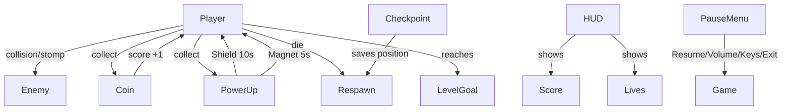

# 2D Runner Game
2D jump 'n' run built as a group project for the Software Engineering module at DHBW Mannheim.
Godot 4.6 + C#, five people, one semester.

## Team
| Member | Role |
|---|---|
| Michael Kurz | Game Logic |
| Schayan | Level & Environment |
| Bartolmay | UI & Menus |
| Maksym Mykhailych | Project Lead & Docs |
| Tim | Sound & FX |

## Tech Stack
- Godot 4.6 · C#
- Git / GitHub – branch per feature
- Taiga – user stories
- FL Studio, Audacity, Serum – audio

## Project Structure
res://
├── Audio/    → Music & Sound Effects
├── Scenes/   → Levels, Main Menu, Game Logic
├── Scripts/  → Gameplay Code (Movement, Collision, Power-ups)
├── Sprites/  → Characters, Backgrounds, Assets
├── Sounds/   → Sound Effects
└── Prefabs/  → Reusable Game Objects

## System Design

### Game Logic (Michael Kurz)

### UI & Menus (Bartolmay) – coming soon
### Level & Environment (Schayan) – coming soon
### Sound & FX (Tim) – coming soon

## Controls
| Key | Action |
|---|---|
| A / ← | Move left |
| D / → | Move right |
| Space / W / ↑ | Jump |
| ESC | Pause |

## Status
In Development – DHBW Semester 3
